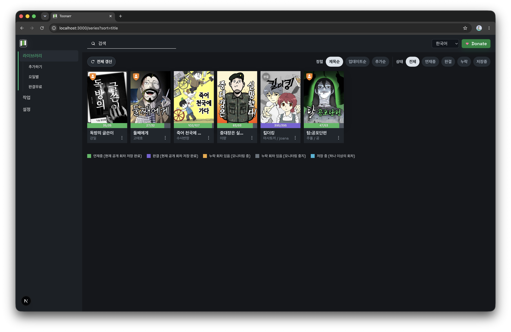
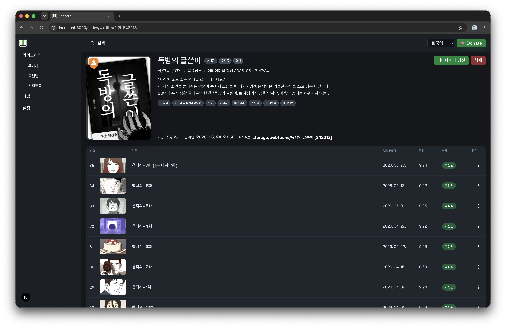
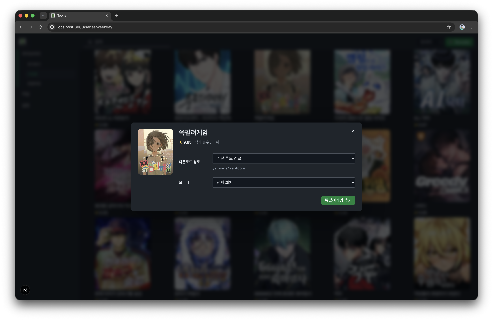

# Toonarr

네이버 웹툰 자동 수집 및 라이브러리 관리를 목표로 하는 개인용 관리자 UI입니다. 개인 서버, Docker, NAS 환경을 기준으로 설계했습니다.

## ✨ 특징

- 웹툰 검색, 요일별 탐색, 완결무료 탐색을 한 흐름으로 관리할 수 있습니다.
- 라이브러리, 상세 정보, 회차 상태를 Sonarr 계열 UI 흐름에 가깝게 확인할 수 있습니다.
- 시리즈 메타데이터와 회차 파일을 로컬 경로에 정리해서 저장할 수 있습니다.
- Docker와 NAS 환경을 염두에 두고 데이터 경로를 분리해 운용할 수 있습니다.
- 성인 웹툰은 외부 PC 브리지 로그인으로 초기 세션을 등록할 수 있습니다.

## 📦 설치 방법

### 로컬 실행

필요 환경:

- Node.js 22 이상
- npm
- Chromium 또는 Google Chrome
- Playwright 브라우저 런타임

```bash
bash -lc 'git clone https://github.com/method404/toonarr.git && cd toonarr && npm ci && npx playwright install chromium && npm run dev'
```

접속 주소: [http://localhost:3000](http://localhost:3000)

### Docker / NAS 실행

필요 환경:

- Docker Engine
- Docker Compose
- 영구 저장용 볼륨 또는 바인드 마운트

가장 단순한 실행:

```bash
bash -lc 'git clone https://github.com/method404/toonarr.git && cd toonarr && docker compose up --build -d'
```

기본 구성:

- 포트: `3000:3000`
- 앱 데이터 경로: `/app/data`
- 기본 다운로드 경로 기준: `/app/storage`

NAS에서는 named volume보다 바인드 마운트를 권장합니다.

```yaml
services:
  toonarr:
    build:
      context: .
      dockerfile: Dockerfile
    ports:
      - "3000:3000"
    environment:
      NODE_ENV: production
      PORT: 3000
      PUID: 1000
      PGID: 1000
    volumes:
      - /volume1/docker/toonarr/data:/app/data
      - /volume1/docker/toonarr/storage:/app/storage
    restart: unless-stopped
```

메모:

- `PUID`, `PGID`는 NAS에서 사용할 실제 사용자/그룹 ID에 맞추는 것을 권장합니다.
- 이미지 변경 후에는 `docker compose build --no-cache` 또는 `docker compose up --build -d`로 재빌드해야 합니다.

### 성인 웹툰 로그인

성인 웹툰은 NAS 내부 브라우저가 아니라 외부 PC 브라우저에서 초기 1회 로그인 세션을 등록하는 흐름을 사용합니다.

1. Toonarr의 `설정 > 계정 정보`에서 네이버 ID를 저장합니다.
2. 외부 PC에서 아래 명령을 실행합니다.
3. 열리는 브라우저에서 네이버 로그인, 2단계 인증, `이 기기에서 2단계 인증 요청 안함`까지 완료합니다.
4. 세션이 Toonarr로 업로드되면 성인 컨텐츠 접근 상태가 갱신됩니다.

```bash
npm exec --yes --package=github:method404/toonarr toonarr-naver-bridge -- --toonarr-url http://TOONARR_HOST:3000 --username "NAVER_ID"
```

메모:

- 명령 실행 중 `Naver password:` 프롬프트가 나오면 네이버 비밀번호를 입력한 뒤 `Enter`를 누르면 됩니다.
- 이후에는 응답 쿠키 자동 반영, 주기적 세션 유지 체크, 저장된 계정 기준 자동 재로그인을 먼저 시도합니다.
- 브리지 로그인을 다시 실행해야 하는 경우는 자동 유지와 자동 재로그인이 모두 실패했을 때의 최종 폴백입니다.

## 🖼 스크린샷






## ⚠️ 주의사항

- 개인 저장 및 개인 열람 목적을 전제로 합니다.
- 수집한 웹툰 파일이나 메타데이터를 재배포, 공유, 판매, 공개 업로드하는 용도로 사용하지 마십시오.
- 무단 공유 및 네이버 약관 위반으로 발생하는 문제는 사용자 책임입니다.
- 프로젝트 제공자는 사용 결과를 보증하지 않습니다.

## 📄 라이선스

이 프로젝트는 GNU Affero General Public License v3.0만 적용하는
[`AGPL-3.0-only`](./LICENSE) 라이선스를 따릅니다.

- 사용, 수정, 배포는 허용됩니다.
- 배포하거나 네트워크 서비스 형태로 제공하는 수정본은 대응 소스 공개 의무가 있습니다.
- 저작권 고지와 라이선스 전문은 함께 유지해야 합니다.
- 사용으로 인해 발생하는 문제나 손해에 대해서는 보증하지 않습니다.
